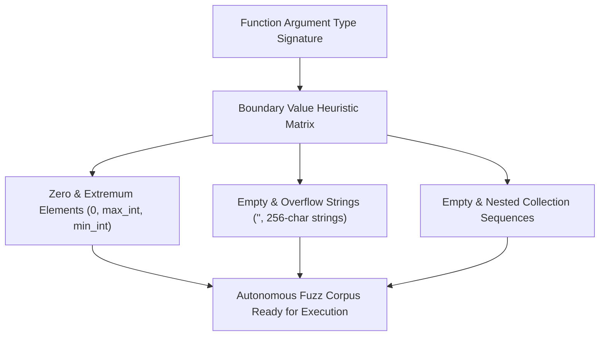

# genpark-autonomous-test-suite-fuzz-generator-skill

Agent Skill implementing **Type-Directed Boundary Value Fuzz Input Synthesis** in 100% Python standard library.

## Architectural Flow

```mermaid
flowchart TD
    TypeSign["Function Argument Type Signature"] --> Evaluator["Boundary Value Heuristic Matrix"]
    Evaluator --> T1["Zero & Extremum Elements (0, max_int, min_int)"]
    Evaluator --> T2["Empty & Overflow Strings ('', 256-char strings)"]
    Evaluator --> T3["Empty & Nested Collection Sequences"]
    T1 & T2 & T3 --> FuzzPool["Autonomous Fuzz Corpus Ready for Execution"]
```
